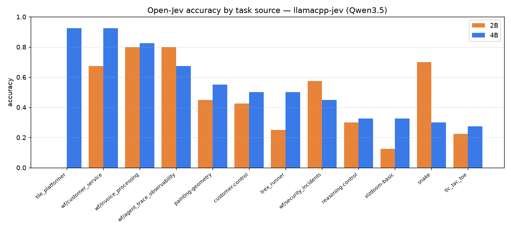
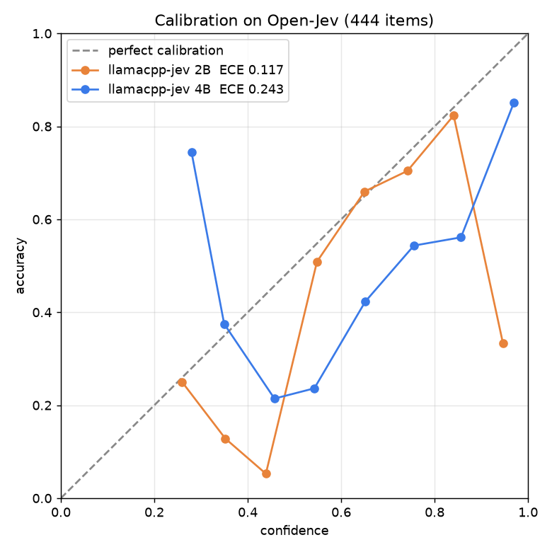

# Benchmark — accuracy & calibration

llamacpp-jev turns any GGUF into a typed-decision engine; the question this answers is whether the
decisions are *correct* and whether the returned probability can be *trusted*, not just whether the
server is fast. Speed is measured separately (it needs an uncontended GPU; see the note at the end).

Reproduce with [`scripts/openjev_bench.py`](../scripts/openjev_bench.py) against a running
`llamajev serve`. Model: `unsloth/Qwen3.5-{2B,4B}-GGUF` Q8_0, Metal, M4 Pro, llama.cpp `3d82ef62`,
default config (4 slots, slot pinning, `--cache-ram 0`), 2026-09-22.

## Open-Jev (public typed-decision benchmark)

[ZefanCai/Open-Jev](https://huggingface.co/datasets/ZefanCai/Open-Jev) — state + a choice/score/noul
question + a gold `target` distribution, across 12 task families (business workflows, control tasks,
and games). Stratified sample of 40 items/source (444 items, seed 7). Accuracy is argmax vs the gold
argmax; ECE and Brier use llamacpp-jev's own returned probabilities.

| model | accuracy | ECE | Brier vs gold | failed |
|---|---|---|---|---|
| Qwen3.5-2B-Q8_0 | 0.459 | 0.117 | 0.524 | 0/444 |
| Qwen3.5-4B-Q8_0 | **0.552** | 0.243 | **0.469** | 0/444 |

Accuracy scales cleanly with model size (+9 points, 2B→4B); Brier improves too.



**Where it works and where it does not.** The engine is strong on business/workflow decisions
(invoice processing, customer service, agent-trace, security-incidents: 0.57–0.93) and weak on
game-state reasoning (vizdoom, tic-tac-toe, tile-platformer, reasoning-control: 0.0–0.33). That is
the expected shape — a text-decision engine handles typed judgments, not spatial game reasoning.
A few per-source inversions (2B > 4B on snake and agent-trace) are real, not smoothed.

## Calibration



Calibration is **task-dependent**, and the doc says so rather than claiming a blanket win:

- **In-domain (clipboard routing, 204 labelled items — cross-engine harness in the sibling
  [verdict](https://github.com/NakliTechie/verdict) repo):** 4B is essentially calibrated — ECE
  0.054, and fitting one temperature on held-out data removes only 0.019 more (recalibration gain).
  2B is overconfident on the same task (gain 0.155). So the "Jev-style probabilities are
  miscalibrated" critique holds at 2B and dissolves by 4B *in that domain*.
- **Out-of-domain (the harder, diverse Open-Jev mix):** both sizes are overconfident (2B ECE 0.117,
  4B ECE 0.243 — the reliability curve sits below the diagonal). The calibration win does **not**
  generalise to arbitrary tasks; measure it on your own data before thresholding.

## Reproduce

```bash
hf download ZefanCai/Open-Jev --repo-type dataset          # once
llamajev serve --model Qwen3.5-4B-Q8_0.gguf --llama-server .../llama-server --slots 4 --port 8000
python3 scripts/openjev_bench.py \
  --openjev-dir ~/.cache/huggingface/datasets--ZefanCai--Open-Jev/snapshots/<rev> \
  --url http://127.0.0.1:8000 --per-source 40 --out openjev.json --curve pairs.json
```

## Speed

Latency is measured on a dedicated, uncontended GPU (a shared machine makes the numbers
meaningless). Prior single-tenant readings are in [docs/DESIGN.md §5](DESIGN.md) (fresh 448×448
image + 4 questions: 526 ms on M4 Pro / 236 ms on an L4). A clean speed run is scheduled separately.
